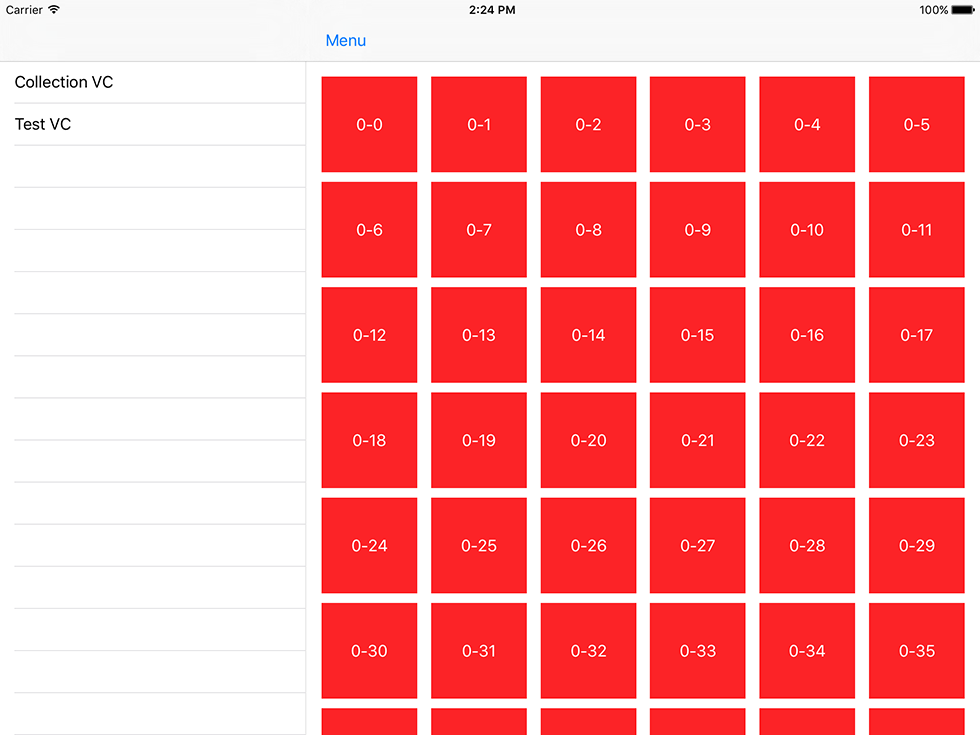
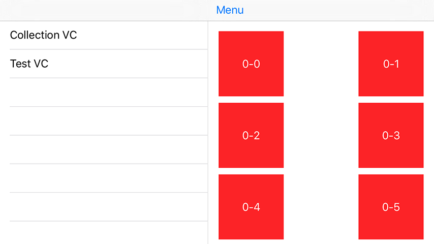
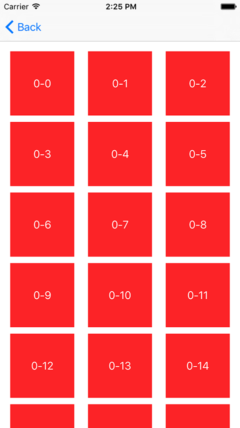

# SplitViewController-iOS9
Split View Controller that supports iOS 9 multitasking for iPad







#### Creating
```swift
let splitViewController = AZSplitController()
    
splitViewController.sideController = (UIStoryboard(name: "Main", bundle: nil).instantiateViewControllerWithIdentifier("Left") as! UINavigationController)
splitViewController.mainController = (UIStoryboard(name: "Main", bundle: nil).instantiateViewControllerWithIdentifier("Center") as! UINavigationController)
splitViewController.templateViewController = (UIStoryboard(name: "Main", bundle: nil).instantiateViewControllerWithIdentifier("AnotherCenter") as! UINavigationController).viewControllers.first
```
`templateViewController` used as `mainController` after rotating from full screen mode

###
Thanks [@spronin](https://github.com/spronin) for the help

Created for [@appintheair](https://github.com/appintheair)
